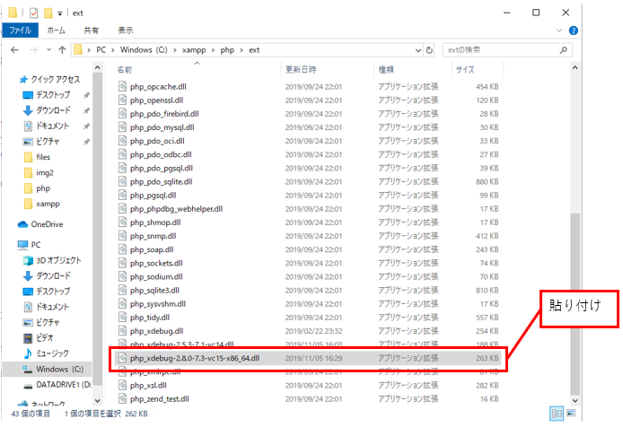
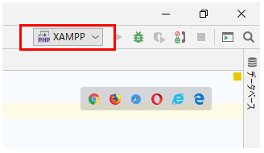
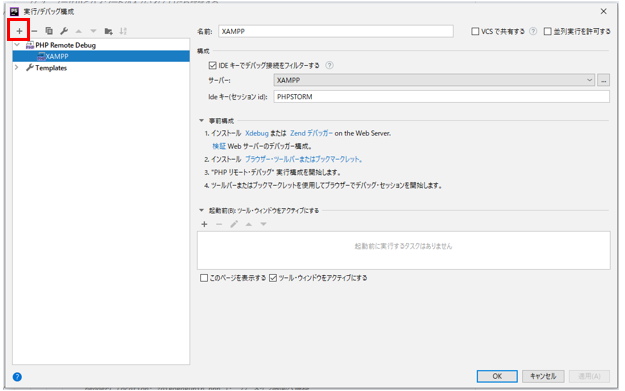
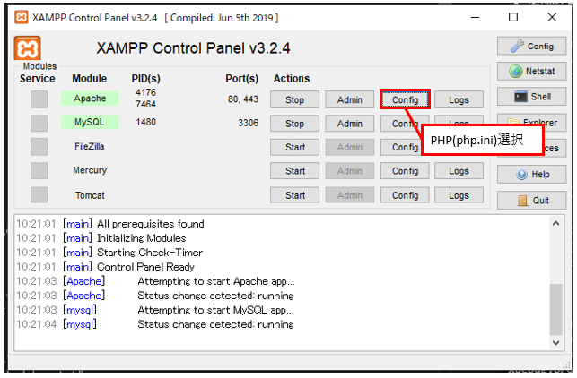
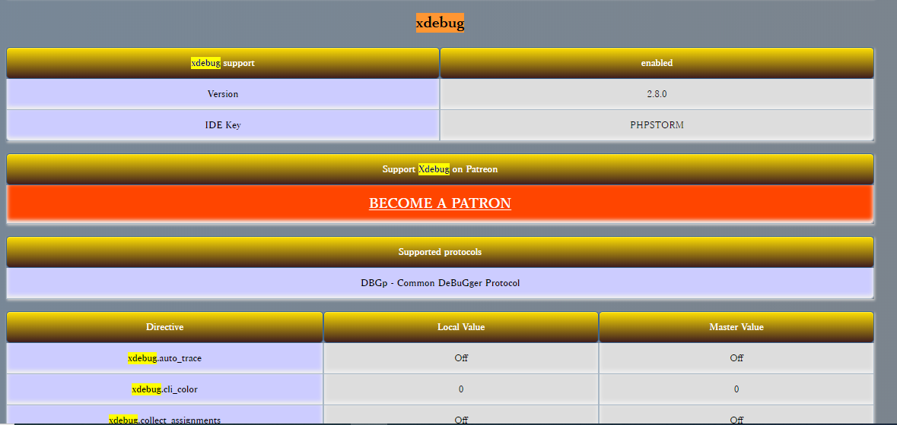

# XDebug設定方法

## 1.XDebugインストール

* php_xdebug-2.8.0-7.3-vc15-x86_64.dll(アプリケーション拡張)」ダウンロード

* C:\xampp\php\extに貼り付け  
 

## 2.Phpstormの設定  

 
* 構成の編集をクリック  
 
* ＋をクリック
* PHP Remote Debugを選択
* 名前:任意（ここではXAMPP）
  
* [x] IDEキーでデバッグ接続をフィルターするにチェック入れる  
* サーバ：「...」を選択する
  * 名前:任意（ここではXAMPP）
  * ホスト：127.0.0.1
  * デバッカー：Xdebug
  * 「OK」ボタン押下
* ideキー（セッション id）:
  * PHPSTORMを記述
  * 「OK」ボタン押下
  
## 3.XAMPPの設定

* PHP（php.ini）を選択  
   
* 下記の記述を追加↓  
  
```bash
[XDebug]  
zend_extension = "c:\xampp\php\ext\php_xdebug-2.8.0-7.3-vc15-x86_64.dll"  
xdebug.remote_autostart = 1  
xdebug.profiler_append = 0  
xdebug.profiler_enable = 0  
xdebug.profiler_enable_trigger = 0  
xdebug.profiler_output_dir = "c:\xampp\tmp"  
xdebug.remote_enable = 1  
xdebug.remote_handler = "dbgp"  
xdebug.remote_host = "127.0.0.1"  
xdebug.remote_log="c:\xampp\tmp\xdebug.txt"  
xdebug.remote_autostart = 1  
xdebug.remote_port = 9000  
xdebug.trace_output_dir = "c:\xampp\tmp"  
xdebug.remote_cookie_expire_time = 36000  
xdebug.idekey = "PHPSTORM"  
```

（注意） xdebug.idekey = "PHPSTORM" と Phpstormの設定のideキーの記述名を一致させる

## 4.XDebugの起動確認

* プログラム内にphpinfo();を記述
* localhostサーバを立ち上げ、XDebugがあることを確認（検索かけると良い）  
 
