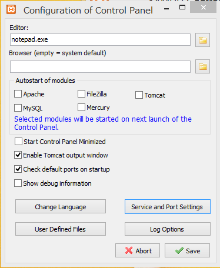
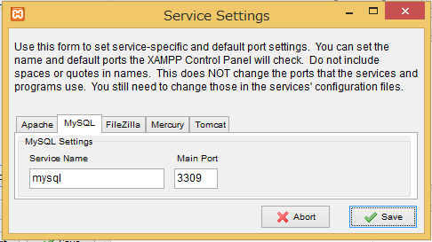
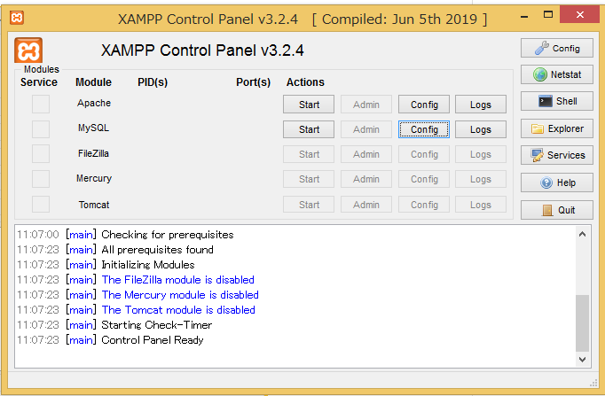
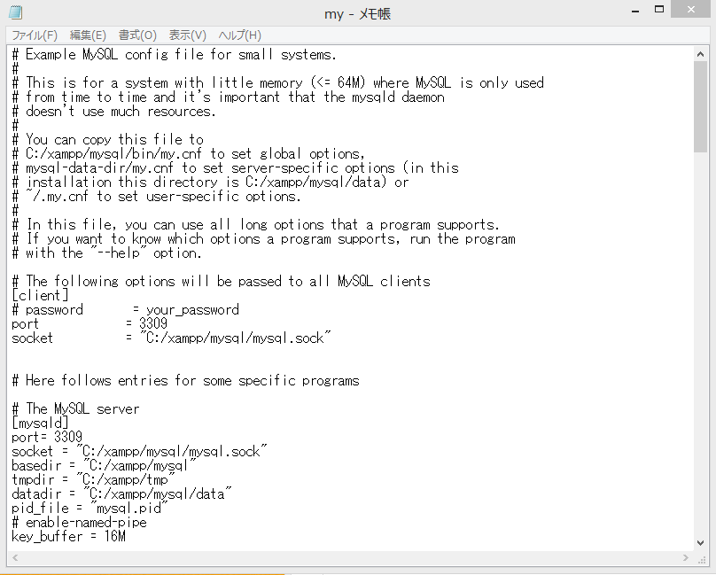
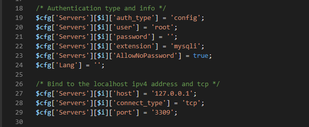
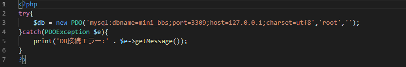

# XAMPP設定

・右上の**Config**ボタン押下

・**Service and Port Settings**ボタン押下

・MySQLタブで Main Portに3309を記述する

・**save**ボタン押下

・MySQLの**Config**ボタン押下---my.iniクリック

  

  
・port = 3309に変更(2か所)

・C:\xampp\phpMyAdmin\config.incより

　29行目の記述を追加する

・実際にPHPとMySQLを連携する際に必要な構文

